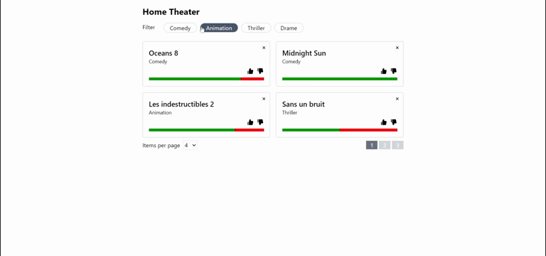

# Movies Card



This project has been made for a React interview from [Particeep - React Interview](https://github.com/Particeep/react-interview).
Follow the link to find the instructions and data provided for the test.

Live demo : https://movies-card.vercel.app

## Stacks

✔️ React

✔️ Written in Typescript

✔️ Redux Toolkit

✔️ TailwindCSS 3

## Features

✅ Responsive

✅ Filter by multiple movie categories

✅ Pagination with `[ 4, 8, 12 ]` options of items show per page

✅ Like or dislike movies

✅ Remove movies

## Installation & Development

```bash
npm install
npm run dev
# For development on LAN (host 0.0.0.0), use :
# npm start
```

## Contributing

Pull requests are welcome. For major changes, please open an issue first to discuss what you would like to change.

Please make sure to update tests as appropriate.

## License

[MIT](https://choosealicense.com/licenses/mit/)
